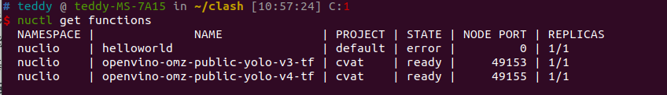
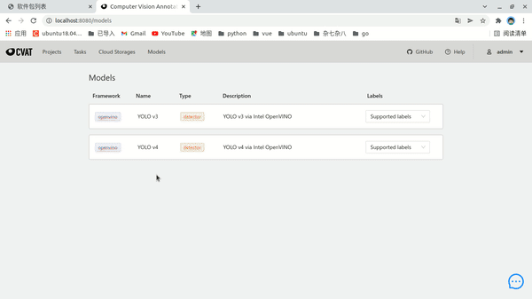
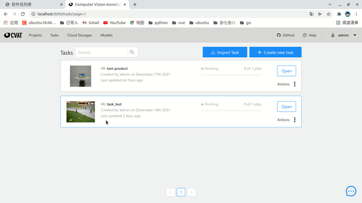

# cvat_yolov4_model
这是一个 为方便使用cvat标注工具自动标注 而创建的项目

在此之前需要先下载 [CVAT](https://github.com/openvinotoolkit/cvat) 的项目部署

需要安装部署好 [CVAT 以及 nuclio](https://openvinotoolkit.github.io/cvat/docs/administration/basics/installation/)

一切部署好之后

1. 把darknet训练出来的yolov4的权重文件*.weights以及配置文件*.cfg放到yolo-weight文件夹下
2. 把本项目构建成 docker镜像，便可使用models进行自动标注

我这边直接在原项目中 创建的，所以我的调用是
```shell
./deploy_cpu.sh ./openvino/omz/public/yolo-v4-tf/
```

如果发现NODE PORT为0的话 需要查一下构建，或者代码是不是有什么错误，处理好，直到出现下面2个的输出


下面是演示，分别是单张识别 和 批量操作


